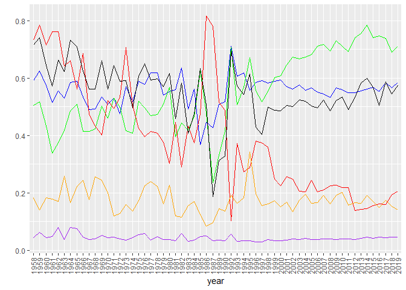
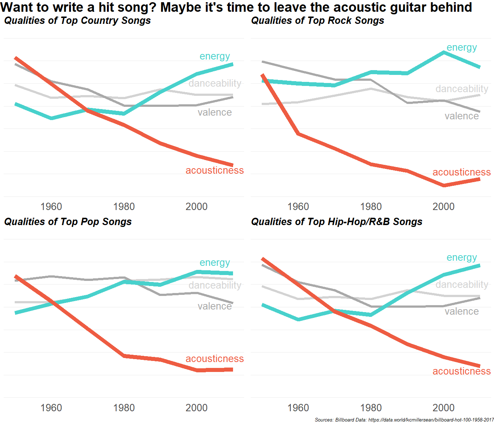

Homework 8

McKayla Hagerty

CS 625, Fall 2020

## Sketches

``` r
p1 <- ggplot(data = mean_data_rockmusic, aes(x = year,group = 1)) + 
  geom_line(aes(y = danceability),color="blue") + 
  geom_line(aes(y = energy),color="green") +
  geom_line(aes(y = speechiness),color="purple") +
  geom_line(aes(y = acousticness),color="red") +
  geom_line(aes(y = liveness),color="orange") +
  geom_line(aes(y = valence)) +
  labs(y = "") # Delete or change y axis title if desired.
p1+theme(axis.text.x = element_text(angle = 90,vjust = .5))
```

<!-- -->

``` r
p1 <- ggplot(data = mean_data_popmusic, aes(x = year,group = 1)) + 
  geom_line(aes(y = danceability),color="blue") + 
  geom_line(aes(y = energy),color="green") +
  geom_line(aes(y = speechiness),color="purple") +
  geom_line(aes(y = acousticness),color="red") +
  geom_line(aes(y = liveness),color="orange") +
  geom_line(aes(y = valence)) +
  labs(y = "") # Delete or change y axis title if desired.
p1+theme(axis.text.x = element_text(angle = 90,vjust = .5))
```

<!-- -->

``` r
p1 <- ggplot(data = mean_data_countrymusic, aes(x = year,group = 1)) + 
  geom_line(aes(y = danceability),color="blue") + 
  geom_line(aes(y = energy),color="green") +
  geom_line(aes(y = speechiness),color="purple") +
  geom_line(aes(y = acousticness),color="red") +
  geom_line(aes(y = liveness),color="orange") +
  geom_line(aes(y = valence)) +
  labs(y = "") # Delete or change y axis title if desired.
p1+theme(axis.text.x = element_text(angle = 90,vjust = .5))
```

<!-- -->

## Final Visualization

``` r
library(ggplot2)
rockmusic <- merged %>% filter(merged$Genre %in% c("rock"))

#New dataframe for mean for each year for just rock music.
library(dplyr)
rockmusic$Decade <- 10*as.integer(as.numeric(substring(as.character(rockmusic$year), 1,4)) / 10)
mean_data_rockmusic <- group_by(rockmusic, Decade) %>%
             summarise(danceability = mean(danceability, na.rm = TRUE),energy = mean(energy, na.rm = TRUE),speechiness = mean(speechiness, na.rm = TRUE),acousticness = mean(acousticness, na.rm = TRUE),liveness = mean(liveness, na.rm = TRUE),valence = mean(valence, na.rm = TRUE),loudness = mean(loudness, na.rm = TRUE))
```

    ## `summarise()` ungrouping output (override with `.groups` argument)

``` r
mean_data_rockmusic <- as.data.frame(mean_data_rockmusic)

popmusic <- merged %>% filter(merged$Genre %in% c("pop"))

#New dataframe for mean for each year for just pop music.
library(dplyr)
popmusic$Decade <- 10*as.integer(as.numeric(substring(as.character(popmusic$year), 1,4)) / 10)
mean_data_popmusic <- group_by(popmusic, Decade) %>%
             summarise(danceability = mean(danceability, na.rm = TRUE),energy = mean(energy, na.rm = TRUE),speechiness = mean(speechiness, na.rm = TRUE),acousticness = mean(acousticness, na.rm = TRUE),liveness = mean(liveness, na.rm = TRUE),valence = mean(valence, na.rm = TRUE),loudness = mean(loudness, na.rm = TRUE))
```

    ## `summarise()` ungrouping output (override with `.groups` argument)

``` r
mean_data_popmusic <- as.data.frame(mean_data_popmusic)

countrymusic <- merged %>% filter(merged$Genre %in% c("country"))

#New dataframe for mean for each year for just country music.
countrymusic$Decade <- 10*as.integer(as.numeric(substring(as.character(countrymusic$year), 1,4)) / 10)
mean_data_countrymusic <- group_by(countrymusic, Decade) %>%
             summarise(danceability = mean(danceability, na.rm = TRUE),energy = mean(energy, na.rm = TRUE),speechiness = mean(speechiness, na.rm = TRUE),acousticness = mean(acousticness, na.rm = TRUE),liveness = mean(liveness, na.rm = TRUE),valence = mean(valence, na.rm = TRUE),loudness = mean(loudness, na.rm = TRUE))
```

    ## `summarise()` ungrouping output (override with `.groups` argument)

``` r
mean_data_countrymusic <- as.data.frame(mean_data_countrymusic)
    
hiphoprnbmusic <- merged %>% filter(merged$Genre %in% c("   
hip-hop/rnb"))

#New dataframe for mean for each year for just hiphop music.
hiphoprnbmusic$Decade <- 10*as.integer(as.numeric(substring(as.character(hiphoprnbmusic$year), 1,4)) / 10)
mean_data_hiphoprnbmusic <- group_by(countrymusic, Decade) %>%
             summarise(danceability = mean(danceability, na.rm = TRUE),energy = mean(energy, na.rm = TRUE),speechiness = mean(speechiness, na.rm = TRUE),acousticness = mean(acousticness, na.rm = TRUE),liveness = mean(liveness, na.rm = TRUE),valence = mean(valence, na.rm = TRUE),loudness = mean(loudness, na.rm = TRUE))
```

    ## `summarise()` ungrouping output (override with `.groups` argument)

``` r
mean_data_hiphoprnbmusic <- as.data.frame(mean_data_hiphoprnbmusic)
```

``` r
library(dplyr)
library(ggplot2)
library(scales)
library(grid)
library(cowplot)
library(gridExtra)
```

    ## 
    ## Attaching package: 'gridExtra'

    ## The following object is masked from 'package:dplyr':
    ## 
    ##     combine

``` r
g1 <- ggplot(data = mean_data_countrymusic, aes(x = Decade,group = 1)) + 
  geom_line(size = 2.4,aes(y = danceability),color="light grey") + 
  geom_line(size = 2.4,aes(y = valence), color="dark grey")+
  geom_line(size = 4,aes(y = energy),color="mediumturquoise") +
  geom_line(size = 4,aes(y = acousticness),color="tomato2") +
  theme_bw() + 
  ylim(0, .9)+
  theme(legend.position = "none", axis.ticks = element_blank(), panel.border = element_blank(), panel.grid.major.x = element_blank(), panel.grid.minor.x = element_blank(), 
    axis.title.x = element_blank(),axis.text.y = element_blank(), axis.title.y = element_blank(), 
    axis.text.x = element_text( margin = margin(t = -8), size = 20),  
    plot.subtitle = element_text(face='bold.italic',size=20, margin = margin(b=0))) +
  annotate("text", x=2005, y=.63, label= "danceability",color="light grey", fontface =1,size = 7) +
  annotate("text", x=2005, y=.78, label= "energy",color="mediumturquoise", fontface =1,size = 7) +
  annotate("text", x=2005, y=.15, label= "acousticness",color="tomato2", fontface =1,size = 7) +
  annotate("text", x=2005, y=.47, label= "valence",color="dark grey", fontface =1,size = 7) +
  labs(subtitle = 'Qualities of Top Country Songs') 

g2 <- ggplot(data = mean_data_rockmusic, aes(x = Decade,group = 1)) + 
  geom_line(size = 2.4,aes(y = danceability),color="light grey") + 
  geom_line(size = 2.4,aes(y = valence), color="dark grey")+
  geom_line(size = 4,aes(y = energy),color="mediumturquoise") +
  geom_line(size = 4,aes(y = acousticness),color="tomato2") +
  theme_bw() + 
  ylim(0, .9)+
  theme(legend.position = "none", axis.ticks = element_blank(), panel.border = element_blank(), panel.grid.major.x = element_blank(), panel.grid.minor.x = element_blank(), 
    axis.title.x = element_blank(),axis.text.y = element_blank(), axis.title.y = element_blank(), 
    axis.text.x = element_text( margin = margin(t = -8), size = 20),  
    plot.subtitle = element_text(face='bold.italic',size=20, margin = margin(b=0))) +
  annotate("text", x=2005, y=.6, label= "danceability",color="light grey",fontface =1,size = 7) +
  annotate("text", x=2005, y=.83, label= "energy", color="mediumturquoise", fontface =1,size = 7) +
  annotate("text", x=2005, y=.14, label= "acousticness",color="tomato2",fontface =1,size = 7) +
  annotate("text", x=2005, y=.45, label= "valence",color="dark grey",fontface =1,size = 7) +
  labs( subtitle = 'Qualities of Top Rock Songs') 

g3 <- ggplot(data = mean_data_popmusic, aes(x = Decade,group = 1)) + 
  geom_line(size = 2.4,aes(y = danceability),color="light grey") + 
  geom_line(size = 2.4,aes(y = valence), color="dark grey")+
  geom_line(size = 4,aes(y = energy),color="mediumturquoise") +
  geom_line(size = 4,aes(y = acousticness),color="tomato2") +
  theme_bw() + 
  ylim(0, .9)+
  theme(legend.position = "none", axis.ticks = element_blank(), panel.border = element_blank(), panel.grid.major.x = element_blank(), panel.grid.minor.x = element_blank(), 
    axis.title.x = element_blank(),axis.text.y = element_blank(), axis.title.y = element_blank(), 
    axis.text.x = element_text( margin = margin(t = -8), size = 20),  
    plot.subtitle = element_text(face='bold.italic',size=20, margin = margin(b=0))) +
  annotate("text", x=2005, y=.625, label= "danceability",color="light grey",fontface =1,size = 7) +
  annotate("text", x=2005, y=.75, label= "energy",color="mediumturquoise",fontface =1,size = 7) +
  annotate("text", x=2005, y=.22, label= "acousticness",color="tomato2",fontface =1,size = 7) +
  annotate("text", x=2005, y=.51, label= "valence",color="dark grey",fontface =1,size = 7) +
  labs( subtitle = 'Qualities of Top Pop Songs') 

g4 <- ggplot(data = mean_data_hiphoprnbmusic, aes(x = Decade,group = 1)) + 
  geom_line(size = 2.4,aes(y = danceability),color="light grey") + 
  geom_line(size = 2.4,aes(y = valence), color="dark grey")+
  geom_line(size = 4,aes(y = energy),color="mediumturquoise") +
  geom_line(size = 4,aes(y = acousticness),color="tomato2") +
  theme_bw() + 
  ylim(0, .9)+
  theme(legend.position = "none", axis.ticks = element_blank(), panel.border = element_blank(), panel.grid.major.x = element_blank(), panel.grid.minor.x = element_blank(), 
    axis.title.x = element_blank(),axis.text.y = element_blank(), axis.title.y = element_blank(), 
    axis.text.x = element_text( margin = margin(t = -8), size = 20),  
    plot.subtitle = element_text(face='bold.italic',size=20, margin = margin(b=0))) +
  annotate("text", x=2005, y=.63, label= "danceability",color="light grey",fontface =1,size = 7) +
  annotate("text", x=2005, y=.78, label= "energy",color="mediumturquoise",fontface =1,size = 7) +
  annotate("text", x=2005, y=.15, label= "acousticness",color="tomato2",fontface =1,size = 7) +
  annotate("text", x=2005, y=.48, label= "valence",color="dark grey",fontface =1,size = 7) +
  labs( subtitle = 'Qualities of Top Hip-Hop/R&B Songs') 

grid.arrange(g1, g2, g3, g4, ncol=2,
     top = textGrob("Want to write a hit song? Maybe it's time to leave the acoustic guitar behind", x = 0,hjust = 0,gp=gpar(fontfamily="sans", fontsize=27,font=2,lineweight=1)), bottom= textGrob("Sources: Billboard Data: https://data.world/kcmillersean/billboard-hot-100-1958-2017",gp=gpar(fontface=3, fontsize=10),hjust=1,x=1))
```

<!-- -->

## Explaination

### The User Takeaway

The users should take away the answer to the question that prompted the
making on this visualization: how have popular songs in key genres
changed over time? Across all four included genres, the energy has
increased and the acousticness has decreased. Country songs still have
more acousticness than other genres but have also seen a steady decline
in this quality. Country and Hip-Hop songs have seen a big increase in
energy since 1980. To a lesser extent, the valence, or happiness, of top
songs has decreased while danceability has remained consistent.
Currently, pop songs are the most danceable songs and rock songs are the
saddest. My title tells a story without trying to explain all the
interesting findings, quickly drawing the attention of users and
enticing them to discover more.

### Visualization Principles and Design Decisions

Choosing the best visualization type to visually present data is
extremely important. I chose to use multiple line charts because my goal
was to show the change in several variables over time. The x-axis has
continuous date values and the y-axis is numeric, scaled values from 0
to 1. Creating the consistent scale from 0 to 1 for all qualities was an
imperative step in creating a visualization that is not distorted or
misleading. My first goal was to compare the trend between different
musical features (energy, danceability, valence, and acousticness) which
prompted the choice of a multiple line chart. By splitting the initial
single line chart into four by grouping by genre, something more
interesting emerged that made a more compelling case about how these
trends can be seen across all major genres. The matrix layout of the
graphs also encourages comparisons between genres. Once my initial
matrix of multiple line graphs was created, I made many additional
customization choices to enhance the user experience:

  - I reduced the number of song qualities included down to four of the
    most interesting ones. This allows for some additional insights and
    context without losing sight of the main intended takeaway. It’s
    better to keep visualizations simple with just enough detail to
    convey the message.
  - I also chose to increase the thickness of the lines of interest that
    relate to the visualization title (acousticness and energy).
    Likewise, these most important line colors are brighter and
    correspond to the positive and negative slopes of each. You’ll also
    notice that these lines are brought to the front of the chart. These
    choices bring the attention to the intended most important song
    qualities.  
  - As for color choices, aquamarine and tomato orange were used rather
    than green and red to allow for easier identification for all,
    including colorblind users.
  - Another change from the sketches to the final visualization is
    increased smoothness of the lines through averaging by decade rather
    than year. I decided more detail was not needed and would
    potentially be distracting.
  - I kept the horizontal grid lines but found the vertical ones and the
    dark axis lines to be overwhelming and unnecessary because the point
    of the visualization is to identify trends rather than look up
    specific dates.
  - The key was removed and instead replaced by line labels. The
    proximity and matching color of these labels allows for
    identification without moving the eyes from each line chart to a
    key.
  - The title and subtitles are both bolded, but the subtitles are also
    italicized to visually offset them from the main title.

## References:

<https://stackoverflow.com/questions/40663586/streamgraph-package-in-r-will-run-the-data-but-no-graph-will-be-shown>
<https://www.quora.com/How-do-I-get-a-frequency-count-based-on-two-columns-variables-in-an-R-dataframe>
<https://stackoverflow.com/questions/10758961/how-to-convert-a-table-to-a-data-frame>
<https://www.datanovia.com/en/lessons/rename-data-frame-columns-in-r/>
<https://www.datanovia.com/en/lessons/subset-data-frame-rows-in-r/>
<https://rdrr.io/github/hrbrmstr/streamgraph/man/sg_axis_x.html>
<https://www.r-graph-gallery.com/158-change-color-in-interactive-streamgraph.html>
<https://stackoverflow.com/questions/3171426/compare-two-data-frames-to-find-the-rows-in-data-frame-1-that-are-not-present-in>
<https://community.rstudio.com/t/converting-dates-year-month-day-to-3-separate-columns-year-month-day/8585/3>
<https://stackoverflow.com/questions/35920408/creating-a-line-chart-in-r-for-the-average-value-of-groups>
<https://stackoverflow.com/questions/30375600/how-to-plot-multiple-lines-for-each-column-of-a-data-matrix-against-one-column>
<https://stackoverflow.com/questions/27082601/ggplot2-line-chart-gives-geom-path-each-group-consist-of-only-one-observation>
<https://stackoverflow.com/questions/15215457/standardize-data-columns-in-r>
<https://www.earthdatascience.org/courses/earth-analytics/time-series-data/summarize-time-series-by-month-in-r/>
